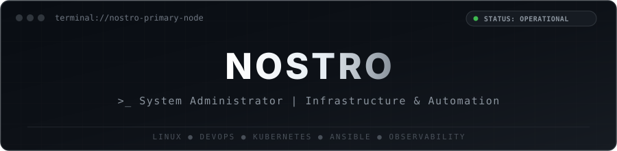

<!-- ========================================================================= -->
<!-- NOSTRO1337 GITHUB PROFILE README                                          -->
<!-- PALETTE: MONOCHROME STEALTH DARK (#000000 / #0D1117 / #21262D / #FFFFFF)  -->
<!-- ROLE: SYSTEM ADMINISTRATOR & INFRASTRUCTURE ENGINEER                      -->
<!-- ========================================================================= -->

<div align="center">

  <!-- HEADER BANNER (LOCAL SVG FOR 100% UPTIME & INSTANT LOAD) -->
  <p align="center">
    
  </p>

  <!-- DYNAMIC TERMINAL PROMPT -->
  <p align="center">
    <a href="https://git.io/typing-svg">
      
    </a>
  </p>

  <!-- QUICK SOCIAL CONTACTS (HIGH CONTRAST GITHUB BUTTONS) -->
  <p align="center">
    <a href="https://t.me/nostro1337" target="_blank"></a>
    &nbsp;&nbsp;
    <a href="mailto:nostro.work@gmail.com" target="_blank"></a>
    &nbsp;&nbsp;
    <a href="https://www.linkedin.com/in/egor-sotnikov-806306437" target="_blank"></a>
  </p>

</div>

---

### 💻 `systemctl status profile.service`

```yaml
╭─ root@nostro-node-01 ~
╰─$ cat /etc/profile.d/nostro.yaml
```

```yaml
user: nostro1337
identity: Nostro
role: System Administrator / DevOps Engineer
availability: 99.999% High Availability
specialization:
  - Linux Systems Architecture & Hardening
  - Infrastructure as Code (Ansible, Terraform)
  - Virtualization & Orchestration (Docker, Kubernetes, Proxmox)
  - Network Engineering, VPNs & Reverse Proxies (Nginx, WireGuard, iptables)
  - Real-Time Observability & Alerting (Prometheus, Grafana, Loki)
mission: "Automate manual routine, maintain zero downtime, guarantee recovery from backups."
sys_quote: "If it hurts, automate it. If it moves, monitor it. If it breaks, restore from backup."
```

---

### 🛠 Стек технологий и инструментов

<div align="center">
  <p><b>ОС, Автоматизация и Оркестрация</b></p>
  <a href="https://skillicons.dev">
    
  </a>
  <br/><br/>
  <p><b>Сеть, Мониторинг и Хранилища</b></p>
  <a href="https://skillicons.dev">
    
  </a>
</div>

---

### 📊 Метрики и активность

<div align="center">
  <!-- STATS & TOP LANGS CARDS (EXTENDED PROXY FOR 100% RELIABILITY) -->
  <a href="https://github.com/nostro1337">
    
  </a>
  <a href="https://github.com/nostro1337">
    
  </a>
  <br/><br/>
  <!-- STREAK STATS -->
  <a href="https://github.com/nostro1337">
    
  </a>
</div>

---

### 🐍 График коммитов (Monochrome Snake)

<div align="center">
  <picture>
    <source media="(prefers-color-scheme: dark)" srcset="https://raw.githubusercontent.com/nostro1337/nostro1337/output/github-snake-dark.svg">
    <source media="(prefers-color-scheme: light)" srcset="https://raw.githubusercontent.com/nostro1337/nostro1337/output/github-snake.svg">
    
  </picture>
</div>

---

<div align="center">
  <sub>● 0 errors, 0 warnings ● system operational ● encrypted connection ●</sub>
</div>
